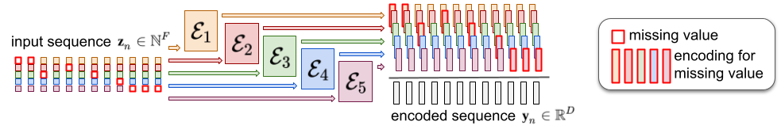

# The Atomizer: a discrete language model for raw audio

## I. Theory

### I.A. Audio atomic representation

**Atoms.** Let $\boldsymbol{X}$ be a raw multichannel $C\times T$ audio waveform, where $C$ is the number of channels and $T$ the number of timesteps. We assume we can express it as a sum of $N$ atoms:

$$\boldsymbol{X} \approx \sum_{n=1}^N \phi \left( z_{n,1},\dots, z_{n,F} \right) ,$$

where $\phi$ is a synthesis function and 

$$\boldsymbol{z}\_n \equiv \[ z\_{n,1}, \dots , z\_{n,F} \]$$

is a $F$-dimensional vector whose $F$ entries are the _features_ of atom $n$ (for instance: velocity, frequency, time position, etc.). Such a decomposition is classical in the domain of _sparse representations_ and any signal can be approximated arbitrarily well in such a way, provided a sufficient number $N$ of atoms is chosen[^1].

**Atoms order**. An interesting feature of this representation is that the order of the atoms is of no importance for reconstruction: we can see atomization as a _bag of features_ view of raw audio. For this reason, the user is left with the possibility to order the atoms given any criterion of interest depending on the application.  
For instance, the atoms may be ordered along increasing time (e.g. for audio continuation), frequency (e.g. for bandwidth extension), velocity (e.g. for audio compression), channels (e.g. for upmixing), or in no particular order whatsoever (e.g. for audio restoration).
    
**Discrete representation.** As a simplifying assumption that works well enough in practice, we assume that all features are _discrete_:
$z_{n,f}\in\[ 1,\dots,N_f\],$ where $N_f$ is the _cardinality_ of feature $f$. When not naturally discrete (as for, e.g. frequency bins), imposing features to be discrete can be simply implemented by quantization.

> In this repository, $\phi$ are Gabor atoms (damped sinusoids), with 5 features comprising their _frequency_, _time_ position, _channel_, _velocity_ and _sign_ (phase).

### I.B. Audio atomization

**From audio to atoms**. As part of our data pipeline, we assume we have an analysis method $\mathcal{A}(\boldsymbol{X})$ that can convert raw audio into a sequence of  $N$ atom features 

$$\mathcal{A}(\boldsymbol{X})=\boldsymbol{Z}\equiv\left\[\boldsymbol{z}\_n\right\]_n,$$

such that 

$$\boldsymbol{X}\approx\sum\_{n=1}^N\phi ( \boldsymbol{z}\_n).$$

There are many ways to derive such an atomization procedure with theoretical guarantees.   
Among them, we can mention the celebrated matching pursuit algorithm[^2], that can be made fast enough for real signals as in [^3]. In that case, the feature space can be made as simple as an index in a _dictionary_ along with some _time shift_ parameter, but structured dictionaries can also be considered where some atoms can be understood as deformed versions of a template, leading to a _wavelet_ representation[^4].

> As an alternative to sparse methods like matching pursuit for atomization, this repository exploits a _critically sampled representation_ called the Modified Discrete Cosine Transform (MDCT[^5]).  
> It is a time-frequency representation of raw-audio. For each channel $c$, we have: 
> $$\boldsymbol{x}\_c=\sum\_{f,t} x\_{cft}\psi (f,t),$$
> where $\psi (f,t)$ are Gabor atoms and $x_{cft} \in \mathbb{R}$ is a time-frequency representation for $$\textbf{x}\_c$$ 
> 
> that tells how much of $\psi (f,t)$ is in the signal. It can be decomposed as 
> $$x\_{cft}=\pm v\_{cft}$$
> with $v\_{cft}\geq 0$ being a _velocity_. This straightforwardly leads to an atomic representation of the form:  
$$\boldsymbol{X}=\sum_{n=1}^{N} \phi(s_n=\pm 1, v_n, f_n, t_n, c_n),$$
where each atom basically stands for the signal present at each time-frequency bin of the MDCT. This sequence runs over all time-frequency bins. To obtain some shorter sequence, we may remove any atom that is not deemed important, e.g. based on a velocity criterion.  
> _note that this simple choice for atomization may replaced by any other fancier atomization method._

**Audio reconstruction**. From a sequence of atom features 
$$\boldsymbol{Z}\equiv\left\[\boldsymbol{z}_n\right\]_n,$$
we assume raw audio can be reconstructed through an inverse procedure $\mathcal{A}^{-1}$ as:
$$\boldsymbol{X}=\mathcal{A}^{-1}(\boldsymbol{Z})=\sum_n\phi\left(\boldsymbol{z}_n\right).$$
The actual way this is done depends on the atomization procedure, and we do not really need to care about these details here. What we do need for all practical purposes is that $(\mathcal{A}^{-1}\circ\mathcal{A})(\textbf{X})\approx\textbf{X}$.

> In our implementation, reconstruction from a series of atom features is simply done through an inverse MDCT.

## II. Model

Through atomization, our audio input has been converted into a sequence of atom features $\textbf{Z}\equiv\{\textbf{z}_n\}_n$, each of which composed of multidimensional discrete data. The core idea of the proposed method is to process audio in this representation through a sequence model from natural language processing.

### II.A. Features encoding

The features encoding is depicted in the figure above. The input sequence is composed of atom features 
$$\boldsymbol{z}_n,$$

each one being a $F$-dimensional vector with discrete entries:
$$z_{nf}\in\[ 1,\dots,N_f\].$$

Our model simply converts each one to a $D$-dimensional vector

$$\mathcal{E}\_f (z\_{nf})\in\mathbb{R}^D$$

and adds them all to produce the actual encoded input sequence $\left\[\boldsymbol{y}_n\right\]_n$
for the model:

$$\boldsymbol{y}_n=\sum_{f=1}^{F}\mathcal{E}_f(z_{nf}),$$ 
 
The embedding function $\mathcal{E}_f:\[1,\dots,N_f\]\rightarrow\mathbb{R}^D$ is typically implemented by _absolute encoding_, i.e. simply storing each $\mathcal{E}_f(k)$ for $k=1,\dots,N_f$, but more sophisticated embedding schemes like sinusoidal ones could be considered.

> It will happen that some of the feature values are unknown. This will typically happen whenever we want to infer the corresponding information.  
In that case, we will write $\boldsymbol{z}_{nf}=\emptyset,$ and will consider that all encoding functions are defined for this value: 
$$\mathcal{E}\_f(\emptyset)\in\mathbb{R}^D.$$
This corresponds to _masks_ in the typical parlance for Transformer models. A particularity of our approach is that we train a different mask for each feature.

### II.B. Atoms sequence modelling

[^1]: Plumbley, Mark D., et al. "Sparse representations in audio and music: from coding to source separation." Proceedings of the IEEE 98.6 (2009): 995-1005.

[^2]: Mallat, Stéphane G., and Zhifeng Zhang. "Matching pursuits with time-frequency dictionaries." IEEE Transactions on signal processing 41.12 (1993): 3397-3415.

[^3]: Krstulovic, Sacha, and Rémi Gribonval. "MPTK: Matching pursuit made tractable." 2006 IEEE International Conference on Acoustics Speech and Signal Processing Proceedings. Vol. 3. IEEE, 2006.

[^4]: Mallat, Stéphane. A wavelet tour of signal processing. Elsevier, 1999.

[^5]: Princen, Johnson, A. Johnson, and A. Bradley. "Subband/transform coding using filter bank designs based on time domain aliasing cancellation." ICASSP'87. IEEE International Conference on Acoustics, Speech, and Signal Processing. Vol. 12. IEEE, 1987.

[^6]: Vaswani, Ashish, et al. "Attention is all you need." Advances in neural information processing systems 30 (2017).
